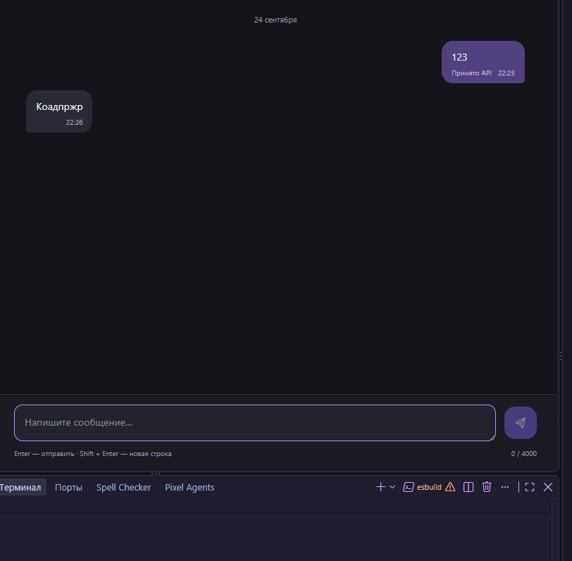

# Чат MAX через GREEN-API

Небольшой React-интерфейс для личной текстовой переписки: подключение инстанса, создание чата по номеру, отправка сообщения и получение ответа. Визуальный ориентир — тёмный интерфейс [web.max.ru](https://web.max.ru/): список чатов слева, переписка справа, поле ввода внизу. На телефоне список и переписка открываются отдельно.

React 19, TypeScript, Vite. Стили — обычный CSS, запросы — `fetch`. Из зависимостей приложения только `react` и `react-dom`. Сервер приложения и SDK не нужны.

**Демо:** [richbanker.github.io/green-api-max-chat](https://richbanker.github.io/green-api-max-chat/)

## Локальный запуск

Нужен Node.js **22.13 или новее** (ветка 22 LTS указана в `.nvmrc`) и npm.

```bash
npm ci
npm run dev
```

Откройте адрес, который выведет Vite, обычно `http://127.0.0.1:5173`.

`.env` не обязателен. По умолчанию используется `https://api.green-api.com`. Если в кабинете инстанса указан другой `apiUrl`, его можно ввести на экране подключения, раскрыв «Адрес API». Для постоянного значения по умолчанию скопируйте `.env.example` в `.env.local`, измените `VITE_GREEN_API_URL` и перезапустите Vite.

**Не записывайте токен в `.env`**: переменные `VITE_*` попадают в браузерную сборку. `idInstance` и `apiTokenInstance` вводятся только через форму.

## Подготовка GREEN-API

1. Создайте инстанс **MAX** в [личном кабинете](https://console.green-api.com/) и авторизуйте его. Дождитесь статуса `authorized`.
2. Скопируйте `idInstance`, `apiTokenInstance` и `apiUrl` из параметров инстанса.
3. В настройках инстанса оставьте `webhookUrl` пустым, включите «Получать уведомления о входящих сообщениях и файлах» (`incomingWebhook: "yes"`). Сохраните настройки и дождитесь их применения.
4. Используйте один клиент получения уведомлений на инстанс. Другая вкладка или интеграция может забрать ответ из общей очереди раньше приложения.

Приложение само не меняет настройки инстанса. Для проверки удобно использовать отдельный тестовый инстанс: приложение подтверждает обработанные уведомления через `DeleteNotification`, после чего они удаляются из очереди GREEN-API.

## Как пользоваться

1. Введите данные инстанса и нажмите «Открыть чат». Приложение проверит подключение методом `GetStateInstance`.
2. Введите номер получателя с кодом страны: `+7…` или `+375…`. Пробелы, скобки и дефисы допустимы. Ограничение РФ/РБ соответствует текущей документации `CheckAccount`.
3. Нажмите `+`. Метод `CheckAccount` проверит аккаунт и вернёт его `chatId`. Для существующего в этой сессии номера повторная проверка не выполняется.
4. Введите текст и отправьте кнопкой или Enter. Shift + Enter добавляет перенос строки. Максимум — 4000 символов.
5. Ответьте с аккаунта получателя в MAX. Ответ появится в соответствующем чате. Для нового отправителя чат добавится автоматически.

Подпись **«Принято API»** означает постановку сообщения в очередь GREEN-API, а не подтверждение доставки или прочтения. При сетевой ошибке текст остаётся в поле ввода; автоматической повторной отправки нет. Перед ручным повтором проверьте MAX: запрос мог выполниться, даже если ответ сервера потерялся.

## Получение сообщений

Используется последовательный цикл `ReceiveNotification` → обработка → `DeleteNotification` с `receiveTimeout=30`. Одновременных запросов получения в одной вкладке нет. При временных ошибках пауза между попытками увеличивается от 2 до 30 секунд; ошибки доступа и настроек останавливают получение и показывают кнопку повтора.

Поддержаны входящие `textMessage` и текст из `extendedTextMessage`, в том числе ссылки и цитируемые сообщения. Повторное уведомление с тем же `idMessage` не создаёт дубль. Медиа, групповые сообщения, служебные события и статусы подтверждаются, но не отображаются: интерфейс предназначен для личного текстового общения. История с телефона не загружается.

## Хранение данных

Данные подключения, сообщения и черновики находятся только в памяти вкладки. `localStorage`, `sessionStorage`, cookies и база данных не используются. Выход или обновление страницы очищают сессию и отменяют активные запросы. Уже подтверждённые уведомления повторно из очереди не загрузятся.

Запросы идут напрямую в GREEN-API по HTTPS. Адрес API проверяется: разрешены только хосты `green-api.com` и его поддомены. Токен не выводится в сообщения об ошибках и не отправляется в аналитику. По контракту GREEN-API токен входит в URL запроса и виден владельцу браузера в Network. Клиентское приложение не может скрыть его от владельца устройства; для общего рабочего сервиса с централизованными ключами нужен отдельный сервер.

## Проверки

```bash
npm run typecheck
npm run lint
npm test
npm run build
npm run preview
```

Сборка находится в `dist/`. Тесты используют встроенный `node:test`, не требуют дополнительных библиотек и не обращаются к реальному API. Они проверяют контракт запросов, валидацию, разбор уведомлений, обработку ошибок, повторы очереди и отмену запросов. Проверки запускаются и в GitHub Actions.

Результаты локальной проверки и сценарий с реальным аккаунтом — в [docs/verification.md](docs/verification.md).

Сверка по пунктам исходного задания и оставшиеся действия — в [docs/requirements.md](docs/requirements.md).

## Демонстрация



На скриншоте показаны исходящее сообщение, принятое GREEN-API, и входящий ответ из MAX.

## Структура

```text
src/
  api.ts              HTTP-клиент GREEN-API, ошибки и таймауты
  chat.ts             разбор сообщений и обновление чатов
  inbox.ts            последовательное получение уведомлений
  validation.ts       правила полей и лимит сообщения
  components/         подключение, список чатов, переписка
  App.tsx             сессия приложения
  styles.css          адаптивный интерфейс
tests/                тесты на подменённых ответах API
```

## Публикация

Рабочая версия размещена на GitHub Pages: [открыть приложение](https://richbanker.github.io/green-api-max-chat/).

Публикация выполняется автоматически из ветки `main` через GitHub Actions. Workflow устанавливает зависимости командой `npm ci`, собирает проект и размещает каталог `dist`. Секреты в настройках хостинга не используются.

Перед коммитом проверьте `git status`: `.env.local`, `node_modules` и `dist` исключены через `.gitignore`. После публикации подключение к GREEN-API нужно проверять из браузера, поскольку доступность API и CORS зависят от адреса инстанса.
## Источники

- [Исходное задание, PDF](https://drive.google.com/file/d/1Ut39kkIs0QK-swnCsIPJc6pNqVIVGOD2/view)
- [Подготовка инстанса MAX](https://green-api.com/v3/docs/before-start/)
- [CheckAccount](https://green-api.com/v3/docs/api/service/CheckAccount/)
- [SendMessage](https://green-api.com/v3/docs/api/sending/SendMessage/)
- [Получение через HTTP API](https://green-api.com/v3/docs/api/receiving/technology-http-api/)
- [Формат текстового уведомления](https://green-api.com/v3/docs/api/receiving/notifications-format/incoming-message/TextMessage/)
